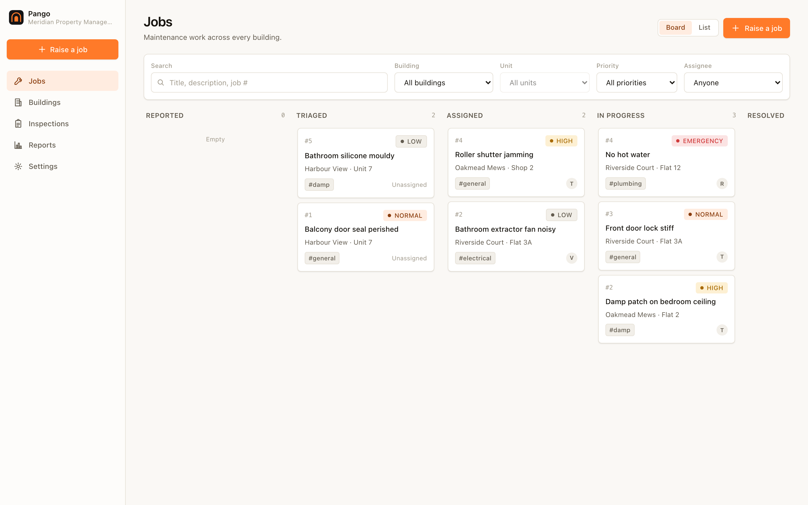
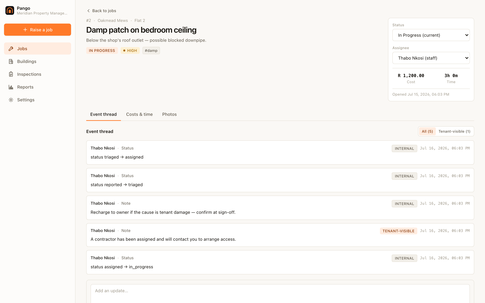
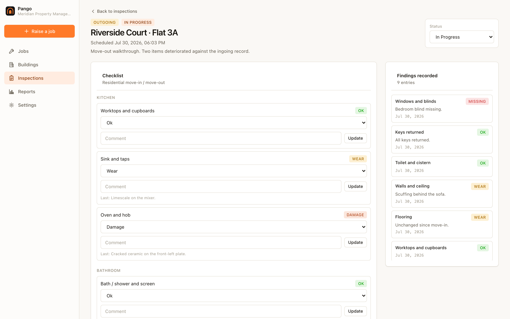
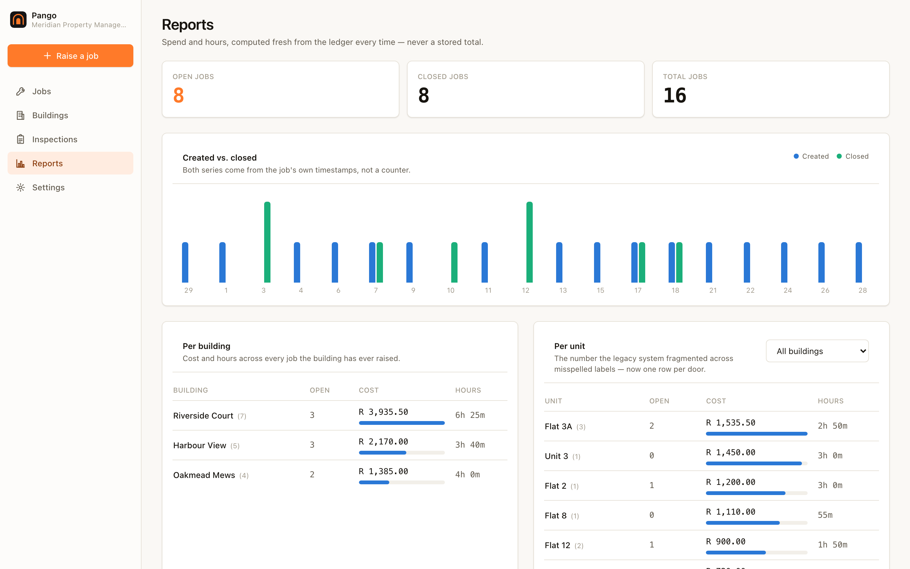
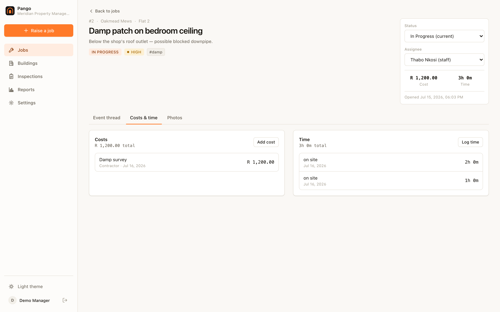
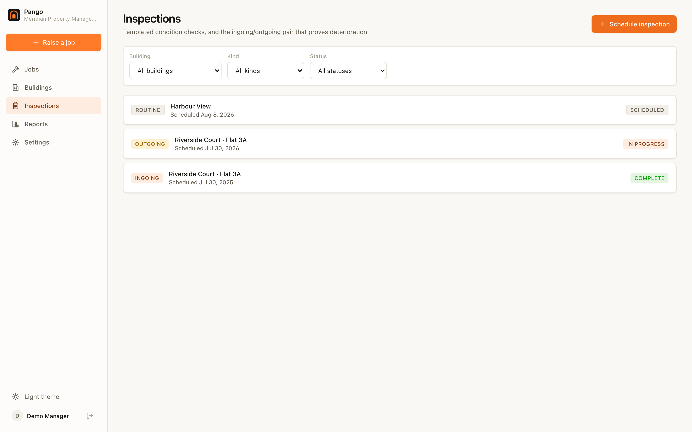
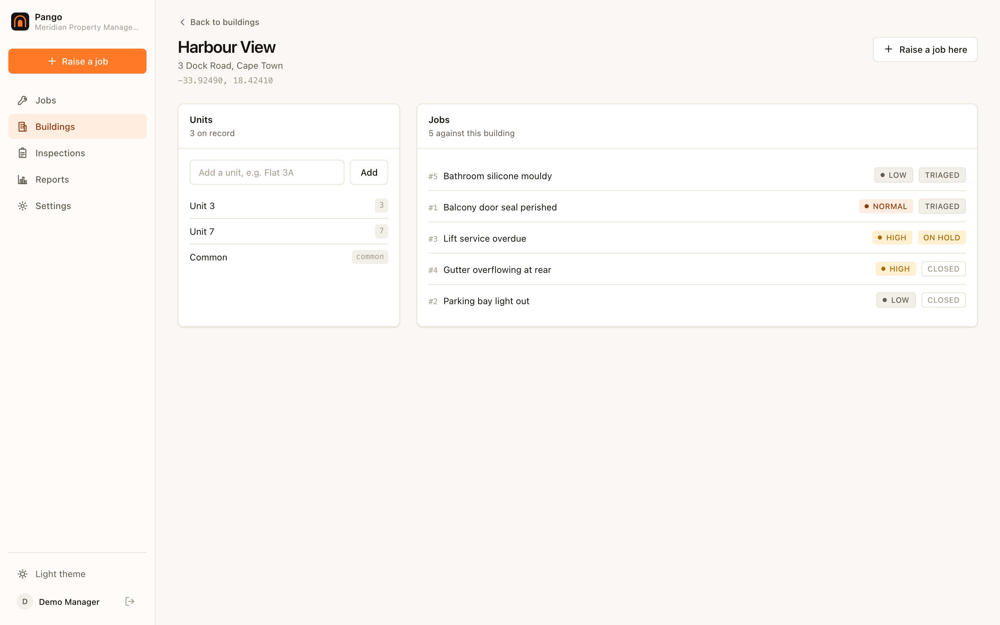
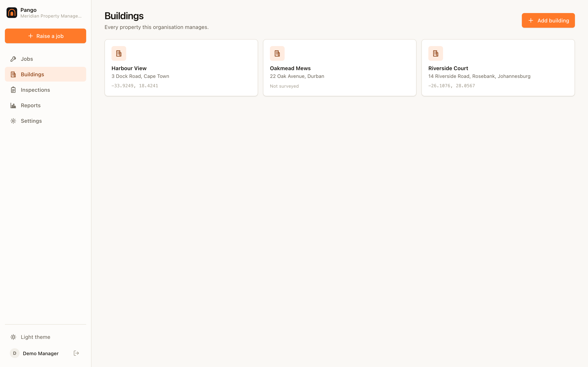
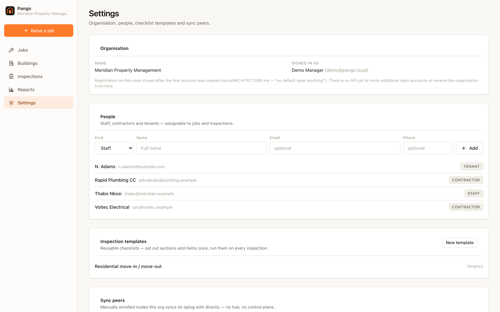
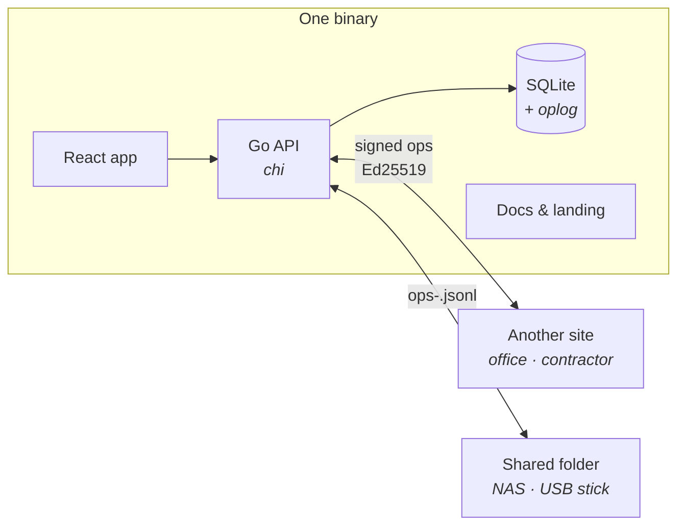

<div align="center">


# Pango

### Know what happened in every unit — and be able to prove it.

Raise a job against a door, cost it as the work happens, close it. Then settle
move-out damage with an **ingoing/outgoing inspection comparison** instead of an
argument.

For managing agents, landlords with a portfolio, body corporates and facilities
teams. **One static binary, one SQLite file.** No cloud account, no subscription,
no external service — and it keeps accepting work with no connection at all.

[](CHANGELOG.md)
[](LICENSE-MIT)
[](docs/SELFHOST.md)
[](docs/SYNC.md)
[](https://golang.org)
[](https://react.dev)

[**Quick start**](#quick-start) · [**Screenshots**](#screenshots) · [**How it works**](#how-it-works) · [**Status**](#status) · [**Docs**](docs/)

<sub><em><strong>Pango</strong> — Swahili for the <strong>lease</strong>, and for the <strong>den</strong> it is held on.<br/>
Part of Vulos — rooted in <strong>vula</strong>, the Zulu and Xhosa word for <strong>open</strong>.</em></sub>

<br/>



</div>

---

## What is Pango?

Maintenance and inspection software for people who look after property —
managing agents, landlords with a portfolio, body corporates, facilities teams.

It runs as **one binary and one SQLite file**. A tablet, a laptop, an office NAS
or a Raspberry Pi is a complete deployment. Copy the file, run it, done.

Two things it does that general ticketing tools do not:

**Costs are per door, not per ticket.** Every job belongs to a unit, and spend
and labour aggregate per building *and* per unit. Units are real records with a
normalised key, so `Flat 3A`, `3A` and `flat 3a` are one door rather than three
rows quietly fragmenting your reporting.

**Inspections compare.** Run an ingoing condition report at move-in and an
outgoing one at move-out, and Pango diffs them item by item — what changed,
in which direction, and what degraded. Damage liability becomes evidence rather
than a disagreement.

## Screenshots

<table>
<tr>
<td width="50%"><br/><sub><em><b>Jobs board</b> — triage across every building, filtered by unit, priority or assignee.</em></sub></td>
<td width="50%"><br/><sub><em><b>Job detail</b> — append-only costs and hours, and an event thread with a tenant-visible toggle per entry.</em></sub></td>
</tr>
<tr>
<td width="50%"><br/><sub><em><b>Move-out walkthrough</b> — a condition scale per item, not a checkbox, with the ingoing record alongside.</em></sub></td>
<td width="50%"><br/><sub><em><b>Reports</b> — created vs. closed over the month, then spend and hours per building and per unit.</em></sub></td>
</tr>
<tr>
<td width="50%"><br/><sub><em><b>The ledger</b> — materials, contractors and hours as separate entries. Nothing is edited; a correction is a new line.</em></sub></td>
<td width="50%"><br/><sub><em><b>Raise a job</b> — against a building and a door. A unit that does not exist yet is created, normalised.</em></sub></td>
</tr>
<tr>
<td width="50%"><br/><sub><em><b>Inspections</b> — ingoing and outgoing pairs per unit, scheduled and tracked.</em></sub></td>
<td width="50%"><br/><sub><em><b>Building detail</b> — units on record with their normalised keys, and every job raised against them.</em></sub></td>
</tr>
<tr>
<td width="50%"><br/><sub><em><b>Buildings</b> — every property the organisation manages.</em></sub></td>
<td width="50%"><br/><sub><em><b>Settings</b> — organisation, people, node identity and sync.</em></sub></td>
</tr>
</table>

<sub>Eleven surfaces, each in light <b>and</b> dark — the full set is in <a href="docs/SCREENSHOTS.md">docs/SCREENSHOTS.md</a>. All captured from the compiled binary in demo mode by <code>npm run screenshots</code>; nothing is mocked up, and the script refuses to write a placeholder if the binary does not serve the app.</sub>

## Quick start

```bash
git clone https://github.com/vul-os/pango && cd pango
npm install && npm run build          # build the app
bash scripts/build-embedded.sh        # compile it into the binary
./backend/pango --demo              # http://localhost:8099
```

Demo mode runs entirely in memory with a seeded portfolio — no database, no
configuration, nothing written to disk. Sign in as `demo@pango.local` /
`demopassword`.

For a real deployment:

```bash
./backend/pango --db /var/lib/pango/pango.db --addr 0.0.0.0:8099
```

The first account you register becomes the owner; registration then closes, and
further accounts are created by an authenticated operator. See
[SELFHOST.md](docs/SELFHOST.md).

## How it works



**The building is the authority.** Whoever manages a building owns its jobs, its
job numbering and its inspections. Because the only contended decision — who
does the work — has exactly one legitimate writer, there is no consensus
protocol, no leader election and no distributed lock anywhere in the system.

**Money and hours are append-only.** A job's cost is `SUM` over its ledger at
read time, never a stored column. Two people costing the same job while
offline therefore *add* rather than overwrite, and a correction is a negative
entry, so the audit trail is complete by construction.

**Peers are enrolled by hand.** No discovery, no rendezvous, no hub. An
operator enters another node's URL; requests are mutually signed with Ed25519.
For sites with no connectivity, each node appends only its own
`ops-<node>.jsonl` to a shared folder — so a NAS or a **USB stick** is a valid
transport with no possibility of a write conflict.

## Status

Honest per-area accounting. A feature that silently does nothing is worse than
one that says it is not built.

| Area | State |
|---|---|
| Jobs — raise, triage, assign, cost, close | **Built** |
| Buildings and units, unit normalisation | **Built** |
| Append-only cost and time ledgers | **Built** |
| Reports — per building, per unit | **Built** |
| Inspections — condition capture, completion | **Built** |
| Ingoing/outgoing comparison | **Built** |
| Auth, org scoping, first-run registration | **Built** |
| Peer sync — HTTP transport, Ed25519 envelopes, folder/USB | **Built**, not yet exercised beyond its test suite |
| WRAP `trades/v0` binding | **In progress** — cross-organisation work orders |
| Tenant portal | **Designed, not built.** The data model carries `public` vs `internal` event visibility; there is no tenant-facing surface yet |
| Photo attachments | **Partial** — references exist; content-addressed blob storage and replication are not built |
| Template versioning | **Open question.** Comparison tolerates template drift by pairing on item text; there is no formal versioning |
| Recurring / planned maintenance | **Not built** |
| Compliance certificates | **Not built** |

## Configuration

| Flag | Default | Description |
|---|---|---|
| `--db` | `pango.db` | SQLite file path |
| `--addr` | `127.0.0.1:8099` | Listen address |
| `--demo` | off | In-memory demo data; forces `:memory:` so it can never touch a real database |
| `--sync-listen` | off | Accept sync from enrolled peers |
| `--sync-peer` | — | Peer URL to sync with |
| `--sync-folder` | — | Shared directory for file transport |

Every networked feature is off by default. A fresh install makes no outbound
connections.

## Documentation

| Doc | |
|---|---|
| [Architecture](docs/ARCHITECTURE.md) | **The binding contract** — read before changing anything structural |
| [Getting started](docs/GETTING-STARTED.md) | Install and first run |
| [Configuration](docs/CONFIGURATION.md) | Flags and settings |
| [Sync](docs/SYNC.md) | The replication protocol in depth |
| [WRAP](docs/WRAP.md) | Cross-organisation work orders |
| [Inspections](docs/INSPECTIONS.md) | Condition capture and comparison |
| [Self-hosting](docs/SELFHOST.md) | Deployment |
| [Cloud & tunnelled nodes](docs/CLOUD-NODE.md) | Running on a public address — a different threat model |
| [Threat model](docs/THREAT-MODEL.md) | Including what is *not* protected |
| [FAQ](docs/FAQ.md) | |

## Development

```bash
npm run dev              # frontend on :5173
npm run build            # production bundle
npm test                 # vitest
npm run test:e2e         # playwright, against the real binary
npm run screenshots      # regenerate docs/screenshots from demo mode
make check               # the full gate
cd backend && go test ./...
```

## Contributing

Issues and pull requests welcome. Read
[ARCHITECTURE.md](docs/ARCHITECTURE.md) first — several of its rules
(append-only money, building-as-authority, author-key tie-breaks) look like
style preferences and are not.

## License

[MIT](LICENSE-MIT) OR [Apache-2.0](LICENSE-APACHE) — © VulOS. Pango is a VulOS project;
source and issues at [github.com/vul-os/pango](https://github.com/vul-os/pango).

---

<p align="center">
  <a href="https://vulos.org"></a><br>
  <sub><a href="https://vulos.org"><b>vulos</b></a> — open by design</sub>
</p>
