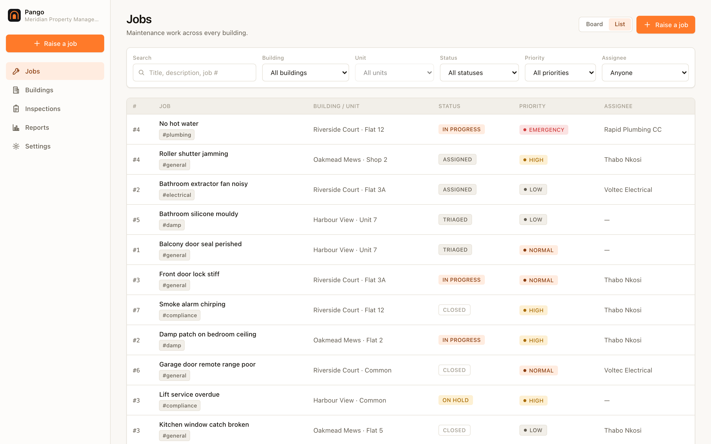
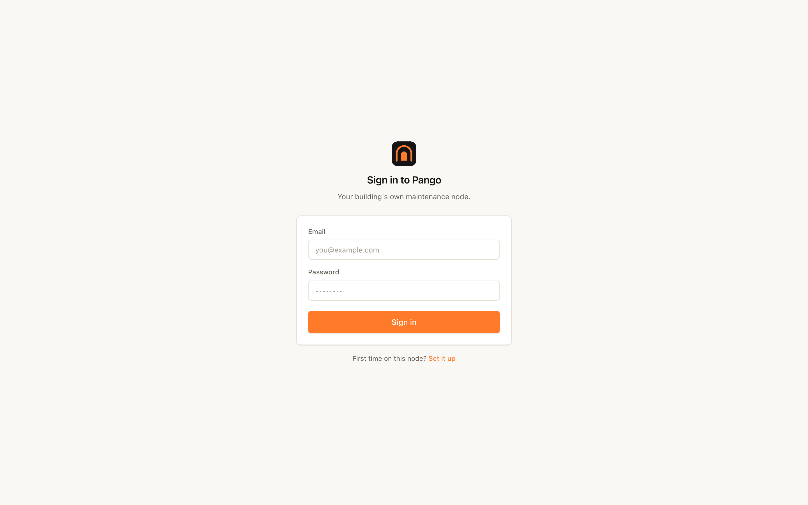
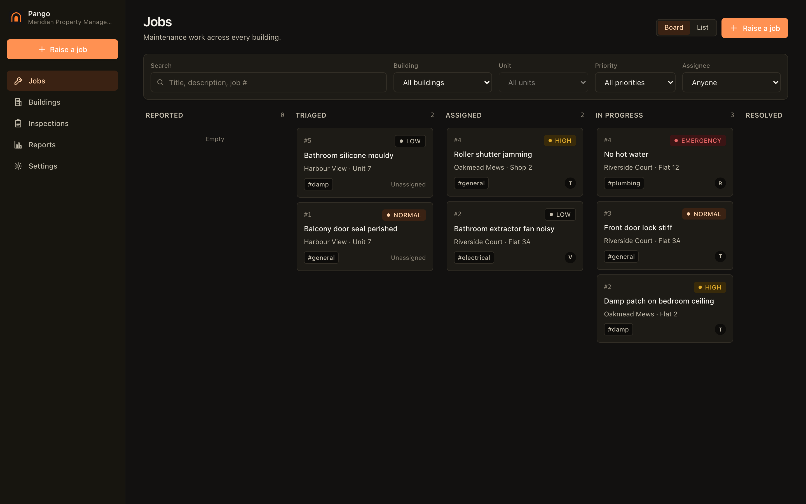
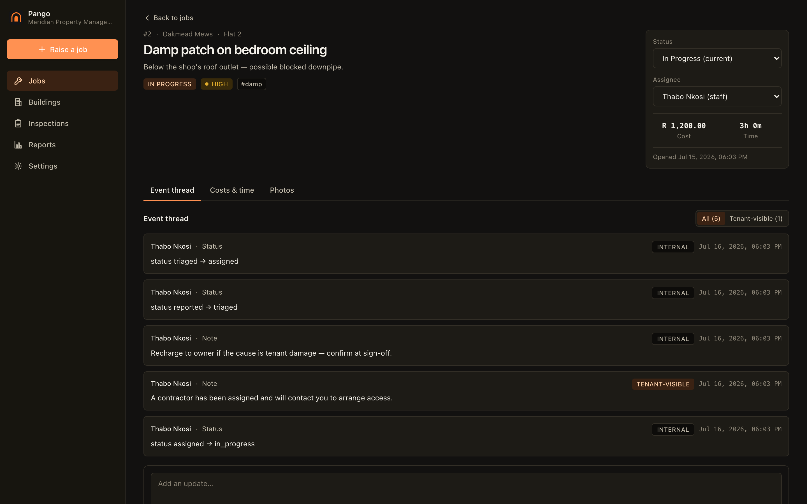
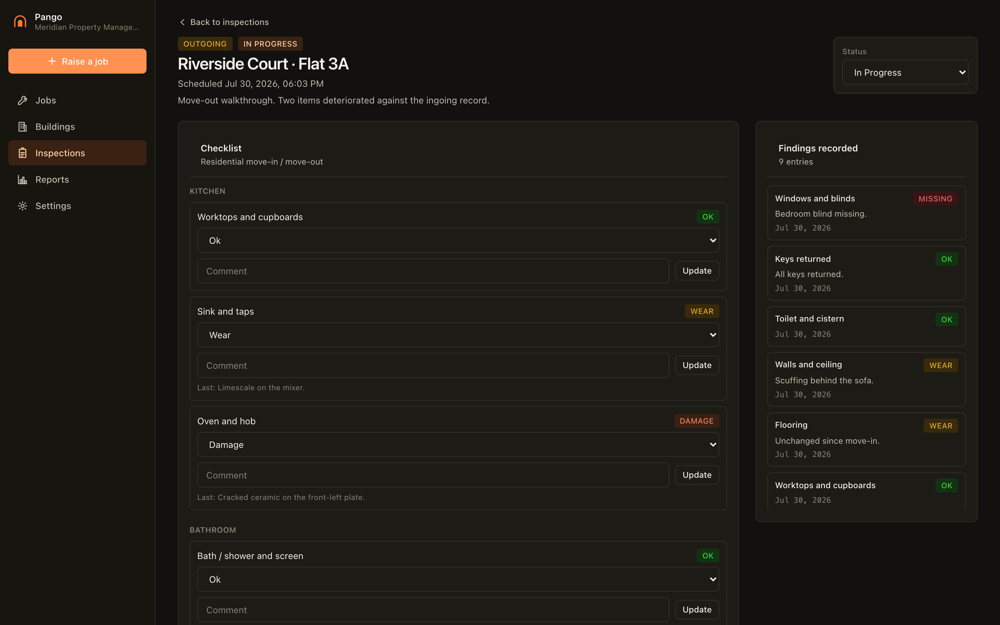
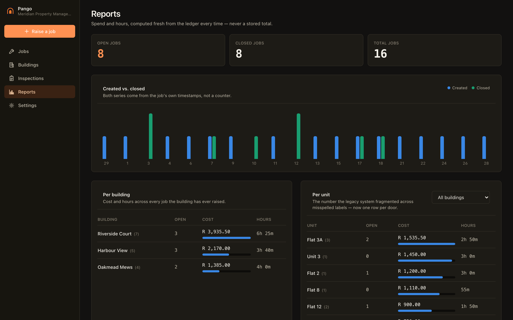

# Screenshots

> [!NOTE]
> **Shipped, and generated.** Every image below is captured by
> `scripts/screenshots.mjs` driving Playwright against the **compiled binary**
> running `pango --demo`. Nothing here is a mockup, a render, or a placeholder.
> If a screen stops rendering, regenerating the gallery is how you find out.

Twelve surfaces, each in light and dark — 25 files including the README hero.
Regenerate the whole set with:

```bash
npx playwright install chromium   # once
npm run screenshots
```

The script boots its own `--demo` instance on port 28899 (or reuses one already
running), signs in with the seeded credentials, walks every route, and writes to
`docs/screenshots/`, mirroring into `site/screenshots/` because the docs viewer
loads them from there.

It **refuses to write anything** if the binary does not actually serve the app —
there is no code path that produces a placeholder image.

---

## Working the board

| | |
|---|---|
|  | **Jobs board** — every outstanding job across the portfolio, in columns by status. Filter by building, unit, priority or assignee. |
|  | **List view** — the same jobs as a dense table, which is what you want once a portfolio outgrows a kanban column. |
|  | **Job detail** — status, assignee, running cost and hours, and the event thread with a tenant-visible toggle on each entry. |
|  | **The ledger** — materials, contractors and hours as separate dated entries. Nothing is edited: a correction is a new line and the total is summed on read. |
|  | **Raise a job** — against a building and a unit. Typing a unit that does not exist yet creates it, normalised. |

## Property records

| | |
|---|---|
|  | **Buildings** — every property the organisation manages. |
|  | **Building detail** — units on record with their normalised keys, and every job raised against the building. |

## Inspections — the differentiator

| | |
|---|---|
|  | **Inspections** — ingoing and outgoing pairs per unit, scheduled and tracked to completion. |
|  | **The move-out walkthrough** — a condition scale per item rather than a checkbox, with the ingoing record alongside as you walk it. Items with no ingoing baseline are marked as such rather than counted against the tenant. |

## Reporting and setup

| | |
|---|---|
|  | **Reports** — created vs. closed over the month, then spend and hours per building and per unit, recomputed from the ledger on every view. |
|  | **Settings** — organisation, people, node identity and sync. |
|  | **Sign in** — the first account registered becomes the owner, after which registration closes. |

## Dark

Every surface ships in both themes. The dark shots carry a `-dark` suffix:

| | |
|---|---|
|  |  |
|  |  |

Full list: `jobs-board`, `jobs-list`, `job-detail`, `raise-job`, `buildings`,
`building-detail`, `inspections`, `inspection-comparison`, `reports`, `job-costs`,
`settings`, `sign-in` — each with a `-dark` variant, plus `hero.png`.

## What the demo data is shaped to show

The seed (`backend/cmd/pango/demo.go`) is deliberately shaped like real work
rather than like test fixtures, because a gallery of empty tables teaches nobody
what the product is:

- **Sixteen jobs spread across about a month**, so the reports timeline is a
  month of activity rather than a single column, and roughly half are closed so
  the "closed" series exists at all.
- **Every status** represented, including on-hold and cancelled.
- **A negative cost entry** — a waived call-out — because corrections are new
  rows, never edits.
- **Three spellings of one door** (`Flat 3A`, `3a`, `3 A`) collapsing onto a
  single unit, which is the bug the unit model exists to prevent.
- **A mixed-use building** where `Shop 2` and `Flat 2` must stay two units.
- **An ingoing/outgoing inspection pair with a real deterioration between them**,
  plus an item with no ingoing baseline — the case that must never be laundered
  into a claim.

## Regenerating

```bash
npm run screenshots     # boots pango --demo, captures docs/screenshots/, mirrors to site/
```

The binary is rebuilt automatically if `src/` or `backend/` is newer than it.
Commit the PNGs with the change that altered them — a stale gallery is a form of
documentation drift.
