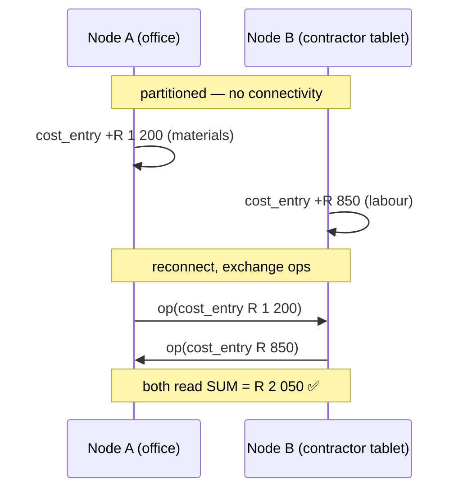
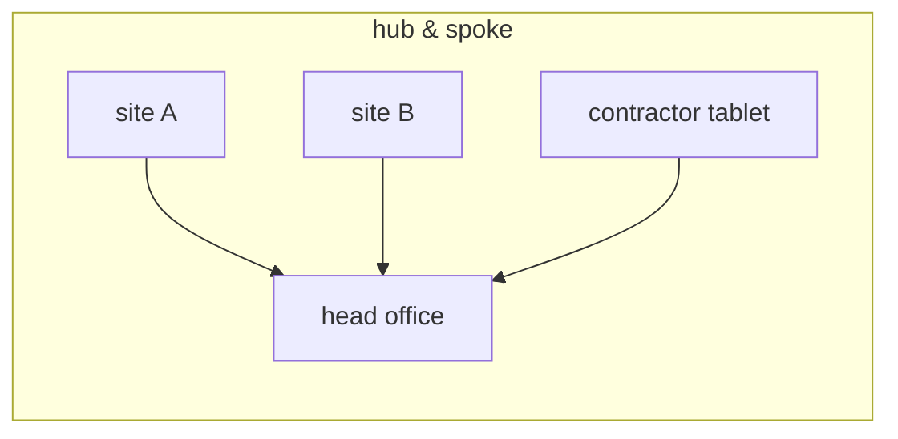

# Sync

> [!NOTE]
> **Shipped.** `internal/sync` implements the protocol this chapter describes
> — the HLC oplog, the HTTP push/pull transport, mutual Ed25519 authentication
> and the folder transport — and it is exercised by `internal/sync`'s test
> suite (two-node and three-node reconvergence, replay ordering, transport
> auth, batch caps). Where a decision is still open, this chapter says so
> rather than picking silently; §11 lists what remains genuinely open.

PropFix's sync is built around one requirement from
[ARCHITECTURE.md](ARCHITECTURE.md) §2: **a node must keep working with no
connectivity at all**, and still end up consistent with every other node later.
A contractor in a basement, a manager walking a block with no signal, an office
whose line is down. There is no central server and no primary node — replication
is leaderless and peer-to-peer.

## 1. Mental model

- Every install is a **node** with its own SQLite database.
- Every change is journalled as an **op** stamped with a hybrid logical clock
  (HLC) that is unique and causally ordered.
- Syncing = exchanging ops. Ops are **idempotent**; applying the same op twice
  is a no-op. Any node can relay any other node's ops.

That last property is what makes the topology free: a node does not need to know
where an op came from to pass it on correctly.

## 2. HLC stamps

A stamp is a lexically sortable string:

```
{unix_ms:013d}-{counter:04x}-{author_hex}
```

- `unix_ms` — 13 zero-padded digits.
- `counter` — 4 hex digits, a monotonic counter within the same millisecond.
- `author_hex` — the **author's Ed25519 public key**.

Sorting the string sorts the ops. No parsing is required to order a batch.

**Both numeric fields are fixed-width, and that is load-bearing.** String order
equals `(wall, counter, author)` order only while neither field can widen. A
counter of `0x10000` renders as five characters, and `1700000000000-10000-k`
sorts *before* `1700000000000-ffff-k` — causal order inverts, silently, with no
error anywhere. The counter is reachable from the network, not only from a
65 536-op burst: `Observe` folds a remote counter forward, so a peer sending
`ffff` would otherwise drive this node past the boundary.

So the implementation bounds both fields and fails closed:

- `ParseHLC` rejects a stamp whose wall exceeds 13 digits (`9999999999999`,
  year 2286) or whose counter exceeds `0xffff`. A hostile or wildly-skewed
  remote cannot drag this node's clock out of width.
- Minting spills instead of widening: the stamp after `…000-ffff-k` is
  `…001-0000-k`, the next millisecond, not a five-digit counter.
- At the very top of the wall range there is nowhere left to spill and the
  counter saturates. Two ticks can then tie. Order stops being strict; it never
  inverts, which is the property convergence actually needs.

These rules are pinned as data in [`conformance/hlc_vectors.json`](../conformance/hlc_vectors.json)
so a second implementation can be held to the same ones — see §11,
"Duplicated sync substrate".

### Why ties break on the author key

An exact `(wall, counter)` tie breaks on the **author public key**, never on a
node identifier. This is not a stylistic choice; it has two consequences that
are load-bearing:

1. **The order is a property of the object.** An op carries everything needed to
   place it. It therefore survives being relayed through a third node, stored in
   a file, and re-imported months later — the order never depends on who handed
   it to you.
2. **The DMTAP-SYNC binding is lossless.** The substrate engine breaks ties on
   the author public key too. Because PropFix's node id **is** its public key,
   the two engines break ties on the same value.

The Vulos suite learned this the hard way: two products independently built
engines that both converged correctly and still disagreed about who won, because
one broke ties on a node id and the other on a key. Two engines with different
total orders cannot share a replica set. Hence the rule in
[CONFIGURATION.md](CONFIGURATION.md): the merge engine is a **deployment-wide
switch, never a gradual rollout.**

### Clock skew

The HLC tolerates skewed wall clocks — an observed timestamp pushes the local
clock forward — but keep node clocks roughly sane (NTP) so that "newest wins"
matches human expectation.

**Forward skew is bounded, because it is not recoverable.** The width bounds
above stop a peer widening a field; they do not stop a peer *inside* those widths
handing over a stamp dated 2085. A hybrid logical clock never moves backwards, so
folding that one stamp in would leave it out-ordering every honest write on this
node **permanently** — no error, no recovery short of editing the database. So
`Observe` refuses a stamp more than **5 minutes** (`store.DefaultMaxDrift`)
ahead of this node's own clock, and leaves the clock untouched when it does.

Two details matter and are easy to get backwards:

- **Seeding is not observing.** A clock is seeded past `MAX(hlc)` from its own
  oplog on open, and that path deliberately skips the bound. A node whose RTC was
  wrong for an hour has real ops stamped in the future; refusing to seed past
  them would leave it minting stamps *below* writes it has already journalled and
  losing every later edit to its own history. The bound exists to stop a stranger
  moving this clock, not to stop it recovering its past.
- **The bound is deliberately looser than the substrate engine's.** The shared
  engine enforces its own §3 skew bound (120 s) on the **op-ingest** path. This
  one guards a different path: a peer's advertised version vector (§6) is a bare
  map of author to newest stamp, and folding one is how a node decides what to
  ask for — no op is involved, so no op-ingest check can fire. Collapsing the two
  into one number leaves whichever path the survivor does not cover unguarded.

## 3. What merges how

This is the section most likely to be broken by someone adding a feature. Read
it before adding a table.

The table below is prose. The **executable** copy is
[`backend/internal/sync/classes.go`](../backend/internal/sync/classes.go), which
holds it as data, and `classes_test.go`, which fails if a migration adds a
replicated table (one with both an `id` and an `hlc` column) that nobody
classified — otherwise a new table would quietly inherit last-writer-wins,
which for anything append-only silently loses concurrent entries. Two consumers
read that list: the built-in engine's apply path, and the substrate binding's
mapping onto the shared algebra's ownership classes (§10).

| Data | Merge rule | Why |
|---|---|---|
| `cost_entry` | **Union.** Immutable, insert-only. | Two people recording spend on the same job while partitioned must **add**. See §4. |
| `time_entry` | **Union.** Immutable, insert-only. | Same argument as cost. |
| `job_event` | **Union.** Append-only. | A thread is the union of what everyone said. Nothing is ever retracted, only superseded by a later event. |
| `finding` | **Union.** Append-only per inspection item. | A condition capture is an observation with a time and an author. It is never edited. |
| `job` (the record) | **Single writer** — the owning organisation of the building. | See §5. |
| Job number sequence | **Single writer**, namespaced per building; reconciled at apply time if two writers ever collide. | Numbers allocate offline with no coordination — see §5's "Job numbers under divergence". |
| Assignment | **Single writer.** | The only contended decision in the product. |
| Inspection scheduling | **Single writer.** | Same authority. |
| `building`, `unit`, `party`, `inspection_template` | **Last-writer-wins** per row, by HLC. | Reference data. The newest edit wins on every node. |
| Deletions of reference data | **Soft** — a `deleted` flag, replicated like any other write. | A hard delete cannot replicate, and a permanent tombstone would swallow a later re-creation of the same row. |
| `attachment` | **Content-addressed.** Union of references; blobs fetched by hash. | Two nodes that capture the same bytes converge on one blob for free. |

### The soft-delete trap

Some CRDT vocabularies offer a *strong* delete that no later write can undo,
meant for redactions and expiries. Using it for ordinary rows looks correct in
every test that only ever deletes — and then silently swallows the next write to
that row, on every node at once, with no error anywhere. PropFix does not use
it. A test that deletes a unit and re-creates it with the same key exists to keep
that true.

## 4. Money and hours: why append-only is a sync decision

`cost_entry` and `time_entry` are immutable and insert-only, and a job's cost is
`SUM(amount_minor)` at read time. **It is never a stored column.**

Consider two people costing job #412 while partitioned:



With a stored `cost` column and last-writer-wins, one of those two amounts is
gone — no error, no conflict marker, no way to notice until the numbers are
wrong at month end. Union merge over immutable facts makes the correct answer
the *only* representable answer.

A correction is a **new entry with a negative amount**, never an edit. The audit
trail is therefore complete by construction: you can always see what was
recorded, by whom, when, and what corrected it.

Money is `int64` **minor units** everywhere. Floats never touch a money path,
and there is a test that fails if a `float64` appears in one.

## 5. Authority: why there is no consensus protocol

**The building is the authority.** Its owning organisation is the single writer
for the job record, the job-number sequence, assignment, and inspection
scheduling.

Everything else is append-only and merges by union. Because the only genuinely
contended decision — *who does the work* — has exactly one legitimate writer,
there is **no consensus protocol, no leader election, and no distributed lock
anywhere in this system.**

This mirrors WRAP's central insight (see [WRAP.md](WRAP.md)): the party who
wants the work done is already the natural authority over who does it. Removing
the race removes the arbiter, and removing the arbiter removes the server.

A contractor's node can *propose* — progress events, costs, findings, all
append-only — but it does not reassign a job. If it needs to hand work back, it
says so as an event and the owning organisation acts on it.

### Job numbers under divergence

"Single writer" above describes the *organisation* that owns a building, not a
single physical device. The same organisation's office node and field tablet
are both legitimate writers, and nothing stops both from raising the FIRST job
against a building neither has synced yet while both are offline — each mints
number 1 with no way to know the other exists. A per-building sequence
allocated by whichever node happens to be writing cannot be globally unique
without coordination, and coordination between offline nodes is exactly what
this architecture exists to avoid.

Rather than journal the counter itself — which would not have prevented this
specific collision anyway, since both nodes allocate before either has heard
from the other — numbers are made collision-free by construction at the point
a collision actually becomes visible: when the two rows meet during sync.
`store/migrations/201_job_number_dedupe.sql` adds a trigger that fires once,
on genuine insertion of a job row (never on an ordinary status or assignment
update), and:

1. records the row's true creation HLC in a column of its own
   (`created_hlc`) — never `job.hlc`, which is overwritten by later status and
   assignment writes, and would make the arbitration depend on unrelated sync
   timing rather than on when the job was actually created;
2. if the insert collides with a row that already claims the same number for
   the same building, bumps whichever of the two is causally **later** by that
   creation stamp — the same author-key tie-break this system uses everywhere
   else (§2) — to one more than the current maximum for that building, which
   is by definition free.

Because the comparison uses two immutable, already-present values, every peer
that ends up holding both rows makes the same decision and lands on the same
number, regardless of which order the two rows reached it in. This converges
correctly for the case that actually happens — two writers — the same way
every other replicated write in this system does.

**Acknowledged limitation.** For three or more nodes that each independently
raise the FIRST job against the very same, never-before-synced building while
all mutually offline, the specific number a "losing" job is bumped to can
depend on the order the rows arrive at a given peer, so different peers are
not guaranteed to land on identical numbers for the same job in that
three-way-or-more scenario (every peer is still guaranteed distinct numbers
and no error — the reconvergence itself never fails). This is recorded
honestly rather than solved by a heavier mechanism that would have to
retroactively renumber already-settled, already-communicated jobs to
guarantee full order-independence — which would trade a rare, cosmetic
inconsistency for the exact failure mode job numbers exist to avoid (§13 of
[ARCHITECTURE.md](ARCHITECTURE.md): a corrected feature that silently breaks a
different guarantee is not a fix).

## 6. Rounds are stateless and symmetric

A sync round with one peer both **pushes** what the peer lacks and **pulls** what
we lack. So:

- Only **one side of any pair needs to be reachable**. The tablet behind CGNAT
  dials the office; the office never needs to reach the tablet.
- **No per-peer state is stored.** Version vectors are *derived from the oplog*
  at round time, not maintained as a table that could drift out of step with the
  log it describes.
- Because no per-peer state exists and ops are self-ordering, **any node can
  relay any other node's operations**.

### Topologies

Anything works, because ops relay transitively:

- **Pair** — an office and a tablet; one dials the other.
- **Hub and spoke** — head office is reachable; every site lists only head
  office. Sites still receive each other's changes through the hub.
- **Mesh** — everyone lists everyone. Most resilient, most configuration.



## 7. Discovery is manual

An operator enters the peer's URL. **No mDNS, no DHT, no rendezvous service, no
directory.** There is nothing to enumerate and nothing to scan for.

This is a deliberate cost: adding a peer takes a human action. In exchange, a
PropFix node on a hostile network advertises nothing, and there is no discovery
infrastructure to compromise, subpoena, or shut down.

## 8. Transport and authentication

Sync endpoints (`/api/sync/*`) live on the app's own HTTP port. There is no
separate sync port.

### The signed envelope

Every sync request is signed with the caller's node key over a canonical
envelope:

| Field | Purpose |
|---|---|
| `method` | Prevents a signed GET being replayed as a POST. |
| `path` | Prevents retargeting a valid signature at another endpoint. |
| `sha256(body)` | Body tampering breaks the signature. |
| `timestamp` | Unix seconds; ±300s freshness window. |
| `nonce` | Random; cached for the freshness window. |

The responder:

1. checks the timestamp is **fresh** — rejecting stale and future-dated
   requests;
2. verifies the signature against the **key presented in the request itself**
   — there is nothing else it could verify against, because a PropFix node
   has no identifier separate from its key (ARCHITECTURE.md §7, §2 below):
   the value that names the caller and the value the signature is checked
   against are the same field. What stops impersonation is not a
   presented-vs-recorded distinction but the two checks that follow: ordinary
   signature soundness (only the holder of a key's private half can produce a
   signature that verifies against it, so presenting somebody else's public
   key gains nothing without their private key) plus membership — the key
   must already be an **enrolled** row in `peer`, or the request must carry a
   valid pairing secret to enrol it on the spot (TOFU, below);
3. rejects a **replayed** `(key, nonce)` seen inside the window.

### The shared secret is a bootstrap, not a gate

A shared secret has exactly one job: **pairing.** A node that has not yet
enrolled a key proves it knows the secret, which authorises the responder to
record (trust-on-first-use) the key it presents. From that moment the node
authenticates **by key**, and the secret is no longer consulted for it.

An optional `PROPFIX_SYNC_SECRET_FALLBACK` lets an already-enrolled peer keep
authenticating by secret alone. It defaults to **off**, so an enrolled peer that
presents no valid signature is **rejected — the mesh fails closed.**

With no secret set and no enrolled key, every request is rejected. **Unenrolled
peers are rejected by default.**

### Threat table

| Threat | What stops it |
|---|---|
| A stranger on the network reaching `/api/sync/*` | No shared secret to bootstrap and no enrolled key → rejected. |
| A captured request replayed later | Freshness window plus the replay-nonce cache. |
| A tampered body, or a signature retargeted at another path | Body hash, path and method are inside the signed envelope. |
| Impersonating an enrolled node | The request must carry a signature that verifies against that node's key — which only the holder of its private half can produce — **and** that key must already be an enrolled `peer` row. Presenting an enrolled node's public key with no matching private key fails at signature verification, before enrolment is even checked. |
| A former contractor whose peer row you deleted | Their key no longer has an enrolled row, so `peerEnrolled` fails and the request is rejected even though the signature itself still verifies fine. Full revocation = **delete the peer row *and* rotate the pairing secret**, since the secret alone would let them bootstrap a fresh key. |
| Someone who learns the pairing secret | They can enrol a *new* key, but cannot forge requests as an *existing* enrolled node. Rotate the secret to stop new enrolments. |
| Two unrelated organisations sharing a secret by accident | Every row and op carries `org_id`; foreign ops are dropped on apply regardless of transport auth. |

### What the signatures do **not** do

Signatures authenticate peers. They do **not encrypt the payload.** Sync traffic
is your maintenance data — job detail, tenant names, unit addresses, costs. Run
it on a trusted path:

- a LAN;
- a VPN or overlay you run yourself (WireGuard, Tailscale, Netbird);
- an HTTPS tunnel — [Ephor](https://github.com/vul-os/ephor) is
  one option, and is an **optional convenience only**. Nothing about sync
  depends on it, and a relay is a content-visible L7 hop: it terminates TLS and
  can see what passes through. Treat it as reachability, not confidentiality.

Peer URLs may be `http://` or `https://`. PropFix will not stop you using plain
HTTP on a LAN, because on a LAN that is often the correct call — but it is your
call, made knowingly.

## 9. Folder transport — files as a wire

Networking is not the only way to replicate. Point every node at a shared folder
— Syncthing, a NAS mount, a synced drive, or a **USB stick**:

- Each node appends **only its own** ops to `ops-<node>.jsonl`. Because every
  node owns exactly one file, **no file ever has two writers**. There is nothing
  to merge and no conflict to resolve — the file-sync tool cannot get it wrong.
- Each node periodically **imports every other** `ops-*.jsonl` through the same
  idempotent apply path used by network sync. Imports are incremental (a byte
  offset per file) and consume only whole lines, so a file still being written is
  read safely up to its last complete line.
- The files are **transport, never truth.** The database is authoritative. The
  files are a durable, replayable log; a brand-new node pointed at the folder can
  rebuild from the files alone.

This needs no ports, no reachability, and no simultaneous connectivity. Two
nodes never have to be online at the same time.

### Sneakernet

For a site with no shared network at all:

1. On node **A**, set the sync folder to the stick and run a folder sync. A
   writes `ops-<A>.jsonl` and imports anything already there.
2. Carry the stick to node **B**. Set B's folder to the stick and sync. B
   imports A's file and writes its own.
3. Carry it back. A imports B's file. Both have converged.

Because the files are append-only and applying an op twice is a no-op, it does
not matter how often the stick is carried, in what order, or whether a trip is
skipped. Every node converges once the bytes reach it.

## 10. The merge engine is a seam — and the substrate is now in it

`store.Merger` is an interface. Leaving it `nil` gives the built-in HLC engine.
Setting it swaps in **DMTAP-SYNC**, the shared substrate engine, so PropFix does
not maintain a private sync algebra forever.

The choice is made **at boot and never mixed**. See the caution in
[CONFIGURATION.md](CONFIGURATION.md#merge-engine--designed): two engines with
different total orders cannot share a replica set, and the failure is silent
divergence rather than an error.

The precondition that makes the swap safe is already in the design: a node's id
**is** its public key, so both engines break an exact tie on the same value.

### What is implemented

`backend/internal/sync/substrate` implements `store.Merger` over
`github.com/vul-os/kotva/bindings/go` — the same compiled Rust algebra the rest
of the suite runs, executed through **wazero**, so `CGO_ENABLED=0` and
single-static-binary cross-compilation are preserved. Select it with
`--merge-engine=substrate`; an unrecognised value is fatal rather than
defaulted, because a typo that quietly ran the other algebra is the one mistake
that cannot be detected afterwards.

**It replaces the algebra, not the clock.** With it installed, the shared engine
decides who won a conflicting write and what an add-only set contains.
`store.Journal` still mints the stamp, because in PropFix a stamp is not only an
ordering device — it is the oplog's primary key and the `hlc` column of every
replicated row. So there is still exactly one minter and no second timeline; the
engine's clock is fed and never asked.

### The two ownership classes

The shared algebra offers six op kinds. PropFix uses two, mapped one-for-one
onto §3's two merge rules:

| PropFix rule | Substrate class | Address |
|---|---|---|
| Last-writer-wins per row | §4.4 LWW register | target `<tbl>/<row_id>`, field `row` |
| Union / append-only | §4.3 add-only set | target `<tbl>/<row_id>`, value stamped |

Granularity is per **row**, not per column, because PropFix journals a whole row
per write. A per-column mapping would claim a merge granularity the product does
not have and would converge differently from the built-in engine on two
concurrent edits to different columns of one row.

**§4.3 identifies a set element by its VALUE.** Two adds carrying identical
bytes are one element with two add-tags, not two elements — and a job's cost is
`SUM(amount_minor)` over its entries, so two collapsed entries read as half the
money, converged, on every replica, with no error anywhere. PropFix is kept clear
of that twice over: the row id is in the **target**, so two independently
recorded entries are different objects rather than equal values; and the element's
**value** is prefixed with the op's own `wall‖counter‖author`, so element
identity equals *op* identity — which is exactly what the oplog's primary key
already is. `substrate_test.go` mints two byte-identical cost entries and fails
if the engine ends up holding one.

The deliberate **non-**choices are recorded in that package's doc comment: no
§4.5 death certificate (it would dominate every later write, so a re-created unit
would be invisible on every replica at once — §3's soft-delete trap), no §4.6
PN-counter for money or hours (it converges on the total and discards the
entries, and the entries *are* the audit trail), and no §4.7 sequence or §4.8
tree, because nothing in the schema is an ordered list or a reparentable
hierarchy.

### Conformance

`substrate/vectors_test.go` drives the substrate's own frozen conformance
vectors, so convergence is measured rather than assumed. The fixtures are **repo**
files, not module files, so they are not vendored with the dependency:

```
git clone https://github.com/vul-os/kotva && git -C kotva checkout bindings/go/v0.2.1
KOTVA_DIR=$PWD/kotva PROPFIX_REQUIRE_SYNC_VECTORS=1 go test ./internal/sync/substrate/ -count=1
```

Without `KOTVA_DIR` the harness skips loudly and names how many vectors went
unverified; `PROPFIX_REQUIRE_SYNC_VECTORS=1` turns that skip into a failure so CI
can insist. This is a **different** claim from the WRAP vectors described in
[WRAP.md](WRAP.md) — those are still unavailable locally — and neither implies
the other.

### What this costs

The engine is a WebAssembly module carried inside the binary. Roughly 90% of the
size it adds is the wazero runtime rather than the algebra, so the increment is
paid once and is nearly flat as more of the algebra is used. The measured figure
for this repository is recorded in the changelog entry for the change rather than
here, where it would go stale.

## 11. Open questions

Recorded honestly rather than decided by omission.

- **Compaction.** The oplog grows with history. A snapshot-and-prune design
  (prune only what every enrolled peer has acknowledged, always keeping the
  newest op per origin so the version vector never regresses) is the obvious
  shape, but it is **not specified here yet** and not implemented.
- **Attachment replication.** Blob references merge by union; the *transfer*
  policy — fetch eagerly, lazily, or on demand, and what a node does when a blob
  it references is unavailable — is not settled.
- **Inspection photo volume.** A full move-out inspection is dozens of photos.
  Whether these ride the folder transport or are fetched separately is an open
  operational question, not a solved one.
- **Verifying convergence.** Answered for the substrate engine, still open for
  the built-in one. `substrate.Engine.StateRoot` is a content address over the
  replica's whole observable state, so two nodes running `--merge-engine=substrate`
  can prove they agree rather than eyeball it, and the convergence tests compare
  roots rather than screens. Nothing equivalent exists for the built-in engine,
  and nothing surfaces the root over the API yet.

### Duplicated sync substrate

Four files in this repository are near-copies of files in FlowStock
(`github.com/vul-os/flowstock`). This is recorded here rather than left to be
rediscovered:

| PropFix | FlowStock counterpart | Relationship |
|---|---|---|
| `backend/internal/store/hlc.go` | `backend/internal/store/hlc.go` | same algorithm; PropFix names the tie-break field `author`, FlowStock names it `node` |
| `backend/internal/store/identity.go` | `backend/internal/store/identity.go` | same algorithm; PropFix returns a typed `ErrCorruptIdentity` where FlowStock returns `sql.ErrNoRows` |
| `backend/internal/sync/folder.go` | `backend/internal/sync/folder.go` | same algorithm, different settings-key prefixes and locking placement |
| `backend/internal/sync/transport_auth.go` | `backend/internal/sync/transport_auth.go` | **diverged.** PropFix's is a redesign, not a copy — see below |

**They must not import each other.** Neither product may take a build or
runtime dependency on the other; a product that stops building because a
sibling repository moved is not self-hostable. The agreed convergence path is a
published substrate crate plus a spec and vectors.

**That crate now exists** — `github.com/vul-os/kotva/bindings/go`, adopted in
§10 — and it retires the duplication for the *algebra*. It does not retire these
four files, and the reason is per-file rather than general:

| File | Status after adopting the substrate |
|---|---|
| `store/hlc.go` | **Stays.** The engine supplies ordering, but PropFix's stamp is also the oplog's primary key and the `hlc` column of every replicated row, so the format cannot be dropped without a schema rewrite. It is additionally the home of the drift bound that has to sit *above* the engine (§2, "Clock skew"), because the engine's `Clock.Observe` takes no receiver reading and structurally cannot check one. |
| `store/identity.go` | **Stays, and was reviewed rather than assumed.** The binding takes a `Signer` — an interface that asks for signatures and never for key material — which is the shape `CryptoSigner` already had. Adopting the binding's own identity objects would mean handing over the seed, so it would be a downgrade. `ErrCorruptIdentity` is kept. |
| `sync/folder.go` | **Stays.** Sneakernet is a transport, not an algebra. Each node appends only its own `ops-<pubkey>.jsonl`, so the file-sync layer never has a conflict to resolve; the substrate has nothing to say about that and nothing better to offer. |
| `sync/transport_auth.go` | **Stays, unchanged.** It authenticates a *request*; the substrate signs an *op*. Both now happen, at different layers. Nothing here was relaxed to accommodate the engine. |

`conformance/hlc_vectors.json` also stays: it is the contract between PropFix's
built-in engine and FlowStock's, and the built-in engine is still what a node runs
by default.

> **One thing FlowStock needs to know.** Adding the drift bound exposed that the
> `tick` group's `seed` field is a node's **own journal high-water mark**, not a
> remote claim — two of those vectors seed decades ahead of `now_ms` on purpose.
> PropFix's harness now seeds through the unguarded path and folds *remote* stamps
> through the bound. The vector data is unchanged; only the harness's reading of
> it moved. A FlowStock copy that spells seeding as `Observe` will fail those two
> vectors the moment it grows the same bound.

What can be done in the meantime, and has been, is to make the copies
*verifiably* agree where a disagreement would be silent. `conformance/hlc_vectors.json`
pins the HLC stamp format, the total order and the tie-break rule as data; both
repositories can run it (PropFix does, in
`backend/internal/store/hlc_vectors_test.go`). Two engines that both converge
and still pick different winners is the failure this guards.

`transport_auth.go` is the one file where PropFix's version should be treated
as the reference rather than the copy. It collapses the node-id/pubkey pair
into one value, so there is no lookup between the identity a caller claims and
the key its signature is checked against; the shared secret is bootstrap-only
rather than also a standing fallback for enrolled peers; and TOFU enrolment
writes a real inbound-only peer row, which gives an operator something to
delete in order to revoke. Adopting that shape elsewhere is a change to make in
the other repository, not here.
